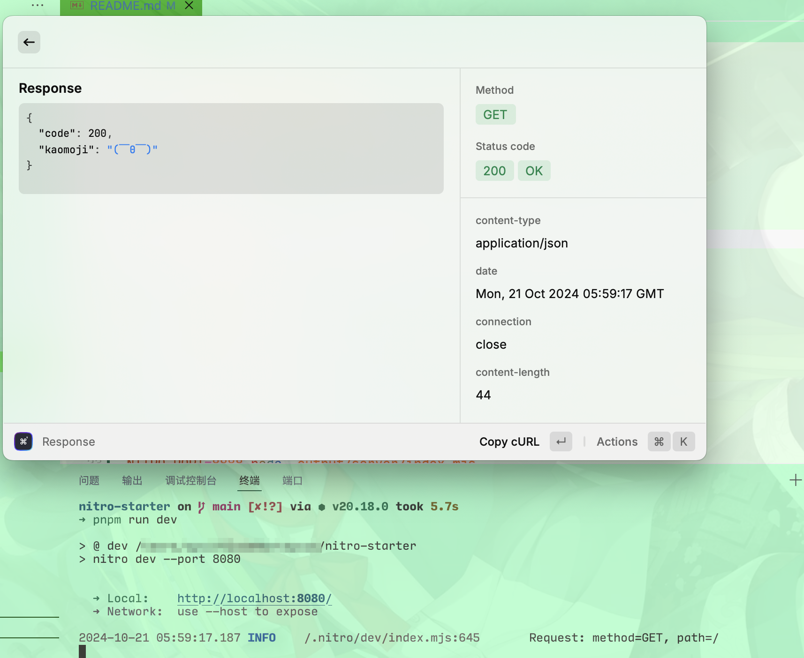

# Nitro starter
Starter of nitro server with some basic config.

Nitro: [https://nitro.unjs.io/](https://nitro.unjs.io/)

# Features
- eslint: auto beautify and fix TypeScript codes, powered by [@antfu/eslint-config](https://github.com/antfu/eslint-config)
- taze: rolling update dependencies.
- tslog: log request method and path on every request(can be further extended).

# Usage
Generate a new repo using this template, or clone to local.

```shell
# dev
pnpm run dev

# lint & fix
pnpm run lint:fix

# build
pnpm run build

# preview
pnpm run start

# start production
NITRO_PORT=8888 node .output/server/index.mjs
```



# License

[MIT License 2024-present @ Vincent-the-gamer](./LICENSE)
